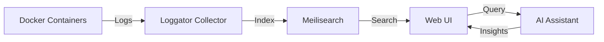

import loggatorLogo from '../../assets/logo.png';

<p align="center">
  
</p>

Loggator is a modern Docker log aggregator that combines powerful search capabilities with AI-assisted log analysis. Built with developer experience in mind, it makes log management and troubleshooting easier than ever.

## What is Loggator?

Loggator collects logs from your Docker containers, indexes them for lightning-fast search, and provides an AI assistant that helps you analyze and understand your logs using natural language.

Think of it as having a smart assistant that:

- 🔍 Instantly finds relevant logs across all your containers
- 🤖 Answers questions about your infrastructure in plain English
- 📊 Visualizes log patterns and anomalies
- 🐳 Automatically discovers and monitors new containers

## Why Loggator?

### The Problem

Managing logs in containerized environments is challenging:

- **Volume:** Containers generate massive amounts of logs
- **Fragmentation:** Logs scattered across multiple containers
- **Complexity:** Hard to correlate events across services
- **Time-consuming:** Manual log analysis is tedious
- **Knowledge gap:** Understanding what logs mean takes expertise

### The Solution

Loggator solves these problems by:

1. **Centralization:** All logs in one searchable index
2. **Intelligence:** AI-powered analysis and insights
3. **Simplicity:** Natural language queries instead of complex filters
4. **Speed:** Meilisearch provides sub-50ms search times
5. **Automation:** Zero configuration after initial setup

## How It Works



### The Flow

1. **Collection:** Loggator connects to your Docker socket and streams logs in real-time
2. **Indexing:** Logs are batched and indexed into Meilisearch for fast search
3. **Search:** Full-text search with filters (container, stream, time range)
4. **Analysis:** AI assistant interprets queries and analyzes logs
5. **Insights:** Get actionable answers and recommendations

## Key Concepts

### Label-Based Monitoring

Loggator only monitors containers you explicitly label:

```yaml
services:
  my-app:
    labels:
      - "loggator.enable=true" # Opt-in monitoring
```

**Benefits:**

- **Security:** Only access authorized containers
- **Performance:** Don't waste resources on irrelevant logs
- **Flexibility:** Easy to add/remove monitoring

### Dual Stream Handling

Loggator captures both output streams:

- **stdout:** Normal application output (blue in UI)
- **stderr:** Error output (red in UI)

This helps you quickly distinguish between informational logs and errors.

### AI-Powered Analysis

Instead of writing complex queries, just ask:

```
"Show me all errors from nginx in the last hour"
```

The AI automatically:

- Searches logs with appropriate filters
- Analyzes patterns
- Explains errors
- Suggests solutions

## Use Cases

### 1. Development

**Scenario:** You're developing a microservices application locally.

**How Loggator helps:**

- Monitor all services in one place
- Quickly find errors when something breaks
- Use AI to understand unfamiliar error messages
- Track requests across services

### 2. Staging/Testing

**Scenario:** You're testing a new deployment before production.

**How Loggator helps:**

- Verify all services start correctly
- Check for warnings or errors
- Compare logs before/after changes
- Use histograms to spot anomalies

### 3. Production Monitoring

**Scenario:** You need to monitor production containers.

**How Loggator helps:**

- Real-time error detection
- Quick incident investigation
- Health check analysis
- Historical log search

### 4. Troubleshooting

**Scenario:** Something broke and you need to find out what happened.

**How Loggator helps:**

- Ask AI: "What happened at 14:30?"
- Get timeline of events
- Identify root cause
- Find related errors

### 5. Capacity Planning

**Scenario:** You need to understand log volume and growth.

**How Loggator helps:**

- View log histograms
- Identify noisy containers
- Plan retention policies
- Optimize resource allocation

## When to Use Loggator

### ✅ Great For:

- **Docker/Docker Compose environments**
- **Development and staging**
- **Small to medium deployments** (1-50 containers)
- **Quick log analysis**
- **Teams wanting AI-assisted troubleshooting**

### ⚠️ Consider Alternatives For:

- **Kubernetes clusters** (use ELK, Loki, or Datadog)
- **Large scale** (100+ containers with high log volume)
- **Compliance requirements** (logs never leave your infrastructure with Loggator, but check AI provider policies)
- **Advanced alerting** (Loggator is for analysis, not alerting)

## Architecture Overview

Loggator consists of three main components:

### 1. Loggator Application

- **Web UI:** Dashboard, search, and chat interface
- **API Server:** RESTful API for programmatic access
- **Log Collector:** Connects to Docker socket
- **AI Integration:** OpenRouter for chat capabilities

**Stack:** SvelteKit, TypeScript, Node.js

### 2. Meilisearch

- **Search Engine:** Full-text log search
- **Indexing:** Real-time log indexing
- **Storage:** Persistent log storage

**Stack:** Rust, Custom search engine

### 3. Docker

- **Socket Access:** Reads container logs
- **Event System:** Detects new/stopped containers
- **Labels:** Determines which containers to monitor

## Performance Characteristics

### Throughput

- **Log ingestion:** ~1000 logs/second
- **Search speed:** Sub-50ms query times
- **Indexing delay:** 0-5 seconds (batching)

### Resource Usage

**Minimum:**

- CPU: 1 core
- RAM: 512 MB (1 GB with logs)
- Disk: 1 GB + log storage

**Recommended:**

- CPU: 2 cores
- RAM: 2 GB
- Disk: SSD with 10+ GB

### Scalability

- ✅ Handles thousands of logs/minute
- ✅ Millions of logs in index
- ⚠️ Single-instance only (no clustering)

## Security Model

### Docker Socket Access

Loggator requires **read-only** access to Docker socket:

```yaml
volumes:
  - /var/run/docker.sock:/var/run/docker.sock:ro
```

This allows:

- ✅ Reading container logs
- ✅ Listing containers
- ✅ Reading container metadata

This does NOT allow:

- ❌ Starting/stopping containers
- ❌ Creating/deleting containers
- ❌ Modifying container configuration

### Label-Based Isolation

Only labeled containers are accessible:

- Prevents access to sensitive containers
- Supports multi-tenant setups
- Explicit opt-in model

### AI Privacy

When using AI features:

- Log data is sent to OpenRouter/AI provider
- Only logs matching your query are sent
- Review provider's data policy
- Consider using self-hosted LLMs for sensitive data

## Comparison with Alternatives

### vs. ELK Stack

| Feature        | Loggator     | ELK        |
| -------------- | ------------ | ---------- |
| Setup          | Minutes      | Hours/Days |
| Resources      | Light        | Heavy      |
| AI Assistant   | ✅           | ❌         |
| Scalability    | Small/Medium | Large      |
| Learning Curve | Easy         | Steep      |

### vs. Docker Logs

| Feature             | Loggator  | docker logs     |
| ------------------- | --------- | --------------- |
| Search              | Full-text | Grep only       |
| Multiple containers | ✅        | Manual          |
| Persistent          | ✅        | Lost on restart |
| AI Analysis         | ✅        | ❌              |
| Web UI              | ✅        | CLI only        |

### vs. Grafana Loki

| Feature          | Loggator | Loki            |
| ---------------- | -------- | --------------- |
| Setup            | Simple   | Complex         |
| AI Assistant     | ✅       | ❌              |
| Full-text search | ✅       | Label-based     |
| Docker-focused   | ✅       | General-purpose |
| Resource usage   | Light    | Medium          |

## Getting Started

Ready to try Loggator? Choose your path:

### Quick Start (5 minutes)

Perfect for trying it out:

```bash
# Download and run
curl -O https://raw.githubusercontent.com/MBeggiato/loggator/main/docker-compose.example.yml
mv docker-compose.example.yml docker-compose.yml
docker compose up -d
```

[Full Quick Start Guide →](/guides/quickstart/)

### Production Setup (30 minutes)

For serious use:

1. Set up secure keys
2. Configure AI assistant
3. Add container labels
4. Configure retention
5. Set up backups

[Installation Guide →](/guides/installation/)

### Development (1 hour)

Want to contribute or customize?

1. Clone repository
2. Install dependencies
3. Start dev environment
4. Make changes

[Development Setup →](/development/local-setup/)

## What's Next?

Now that you understand what Loggator is, here are the next steps:

1. **Get Started:** [Quick Start Guide](/guides/quickstart/)
2. **Learn Features:** [Dashboard](/features/dashboard/), [Search](/features/log-search/), [AI Assistant](/features/ai-assistant/)
3. **Configure:** [Environment Variables](/configuration/environment/), [Docker Setup](/configuration/docker/)
4. **Integrate:** [API Reference](/api/overview/)

## Community & Support

- **GitHub:** [Report issues and contribute](https://github.com/MBeggiato/loggator)
- **Documentation:** You're reading it!
- **Discussions:** Ask questions and share ideas

---

**Ready to revolutionize your log management?** [Get started now →](/guides/quickstart/)
